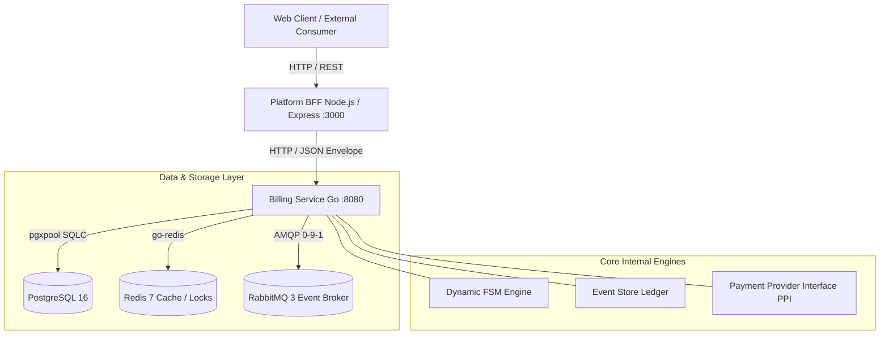

# Gebeta Billing Documentation

This documentation repository provides a comprehensive technical reference for the **Gebeta Billing System**, including its PostgreSQL database schema, data integrity rules, finite state machine (FSM) engine, and the complete HTTP API layer (Core Go Billing Service and Platform Node.js Backend-For-Frontend).

The documentation is structured for publication on **GitBook** and directly reflects the production codebase.

---

## System Architecture

The billing infrastructure is designed as a distributed, event-driven ledger and subscription lifecycle platform composed of the following services:

### Core Components

1. **Billing Service (`internal/`, `cmd/main.go`)**:
   - Written in Go 1.22+.
   - Uses `pgx/v5` and `sqlc` for type-safe database queries.
   - Enforces monetary arithmetic via the integer minor-unit `money.Money` package.
   - Embeds a generic, durable relational Finite State Machine engine (`internal/shared/statemachine`) managing invoice and subscription lifecycles.
   - Houses an append-only event store ledger (`event_log`) with optimistic concurrency.
   - Exposes authoritative domain HTTP endpoints mounted via Go 1.22 `http.ServeMux` at `/api/v1/...` on port `8080`.

2. **Platform BFF (`platform/bff/`)**:
   - Written in Node.js (ES modules) with Express 4.
   - Acts as the secure gateway and presentation shaper for browser clients.
   - Applies security headers (Helmet), CORS, JSON payload size restrictions (100kb), rate limiting (100 req/min), and input validation via strict field extractors.
   - Relays validated requests to the Billing Service, unrolls responses into standard envelopes `{ success, data }`, and normalizes upstream faults into structured HTTP errors.

3. **Storage & Infrastructure**:
   - **PostgreSQL 16**: Primary relational database containing 36 tables (reference lookups, billing catalogs, accounts, subscriptions, invoices, event log, payment attempts, webhook receipts, and state machine persistence).
   - **Redis 7**: Distributed caching and session locking support.
   - **RabbitMQ 3**: Message broker handling asynchronous domain events (e.g. `ppi.webhook.payment.succeeded`, `ppi.webhook.payment.failed`).

---

## Documentation Roadmap

- **Database Reference**:
  - [Architecture & Conventions](database/README.md)
  - [Entity-Relationship Diagram](database/erd.md)
  - [Complete Schema & Tables](database/tables.md)
  - [Enums & Lookup Tables](database/enums-and-lookups.md)
  - [Indexes & Constraints](database/indexes-and-constraints.md)
  - [Functions, Triggers & Concurrency](database/triggers-and-functions.md)
  - [State Machine Engine Schema](database/state-machine-engine.md)
  - [Inconsistencies & Edge Cases](database/inconsistencies-and-gotchas.md)

- **API Documentation**:
  - [API Overview & Conventions](api/README.md)
  - [Account Management API](api/accounts.md)
  - [Tariff & Plan API](api/tariffs-and-plans.md)
  - [Subscription API](api/subscriptions.md)
  - [Invoice Management API](api/invoices.md)
  - [Payments & PPI API](api/payments-and-ppi.md)
  - [Webhooks API](api/webhooks.md)
  - [Platform BFF Gateway API](api/platform-bff.md)
  - [OpenAPI Specification (YAML)](openapi.yaml)
  - [OpenAPI Specification (JSON)](openapi.json)
