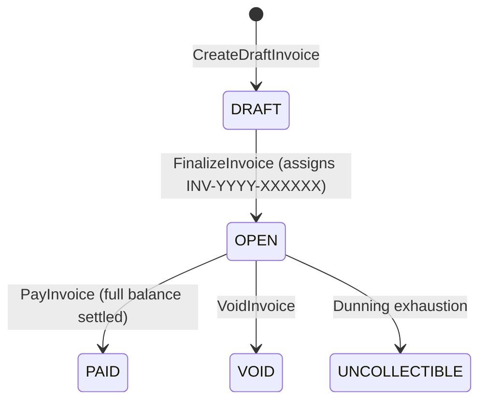

# Invoices API

The Invoices API handles financial statements, line item breakdowns, invoice generation, and payment settlement.

---

## 1. Invoice Lifecycle & States



1. **`DRAFT`**:
   - Invoice created with line items; balances are unfinalized. `invoice_number` is `NULL`.
2. **`OPEN`**:
   - `invoice_number` is generated atomically via `invoice_number_seq`.
   - Subtotal, tax, discount, total, and amount due are computed and locked.
   - Financial totals become permanently immutable via database trigger `protect_finalized_invoice_header()`.
3. **`PAID`**:
   - Payment succeeds via gateway. `amount_paid` matches `total_amount`, `amount_due` is `0`, and `paid_at` timestamp is recorded.

---

## 2. Generate Dev Invoice

`POST /api/v1/dev/invoices/generate`

Development and test endpoint that generates an `OPEN` invoice for an account and plan. Resolves the purchasable item for the plan, creates a draft invoice, appends an event to the ledger, and transitions the invoice through the state machine to `OPEN`.

### Request Body Schema
| Field | Type | Required | Description |
| :--- | :--- | :--- | :--- |
| `account_id` | integer | **Yes** | Target account ID (> 0). |
| `plan_id` | integer | **Yes** | Plan ID to invoice (> 0). |

### Example Request
```json
{
  "account_id": 1,
  "plan_id": 1
}
```

### Success Response (`201 Created`)
```json
{
  "success": true,
  "data": {
    "invoice_id": 1,
    "account_id": 1,
    "invoice_number": "INV-2026-000001",
    "status": "OPEN",
    "currency": "ETB",
    "subtotal": {
      "amount_minor": 1000,
      "currency": "ETB"
    },
    "tax": {
      "amount_minor": 0,
      "currency": "ETB"
    },
    "discount": {
      "amount_minor": 0,
      "currency": "ETB"
    },
    "total": {
      "amount_minor": 1000,
      "currency": "ETB"
    },
    "amount_paid": {
      "amount_minor": 0,
      "currency": "ETB"
    },
    "amount_due": {
      "amount_minor": 1000,
      "currency": "ETB"
    },
    "due_at": "2026-10-16T10:00:00Z",
    "finalized_at": "2026-10-02T10:00:00Z",
    "line_items": [
      {
        "line_item_id": 1,
        "item_id": 1,
        "description": "PRO_SUBSCRIPTION",
        "quantity_value": 1,
        "quantity_unit": "units",
        "unit_amount": {
          "amount_minor": 1000,
          "currency": "ETB"
        },
        "total_amount": {
          "amount_minor": 1000,
          "currency": "ETB"
        }
      }
    ]
  }
}
```

---

## 3. Pay Invoice

`POST /api/v1/invoices/{invoiceID}/pay`

Charges the outstanding balance (`amount_due`) of an `OPEN` invoice using the specified payment gateway.

### Path Parameters
- `invoiceID` (integer, required): ID of the open invoice.

### Request Body Schema
| Field | Type | Required | Description |
| :--- | :--- | :--- | :--- |
| `provider_code` | string | **Yes** | Gateway code (e.g. `"fake"`, `"chapa"`, `"stripe"`). |
| `idempotency_key` | string | **Yes** | Client-generated unique transaction token. |

### Example Request
```json
{
  "provider_code": "fake",
  "idempotency_key": "tx_inv1_1727865600"
}
```

### Success Response (`200 OK`)
```json
{
  "success": true,
  "data": {
    "status": "PENDING",
    "internal_tx_id": "tx_inv1_1727865600",
    "provider_reference": "fake_ref_6b1e5a28-3e4e-4f7d-8f2c-e5d0a68c92a1",
    "checkout_url": "https://checkout.fake-provider.com/pay/fake_ref_6b1e5a28-3e4e-4f7d-8f2c-e5d0a68c92a1"
  }
}
```

### Error Responses
- **`400 Bad Request`**: Invoice is not in `OPEN` status, or payment was rejected.
  ```json
  {
    "success": false,
    "error": {
      "code": "invalid_status",
      "message": "Invoice must be in OPEN status to be paid"
    }
  }
  ```
- **`404 Not Found`**: Invoice ID does not exist.

---

## 4. Get Invoice

`GET /api/v1/invoices/{invoiceID}`

Fetches an invoice and its itemized line items.

### Path Parameters
- `invoiceID` (integer, required): Target invoice ID.

### Success Response (`200 OK`)
Returns complete invoice object including all `line_items`.

---

## 5. List Account Invoices

`GET /api/v1/accounts/{id}/invoices`

Retrieves all invoices billed to the given account ID.

### Path Parameters
- `id` (integer, required): Target account ID.

### Success Response (`200 OK`)
```json
{
  "success": true,
  "data": [
    {
      "invoice_id": 1,
      "account_id": 1,
      "invoice_number": "INV-2026-000001",
      "status": "OPEN",
      "currency": "ETB",
      "total": { "amount_minor": 1000, "currency": "ETB" },
      "amount_due": { "amount_minor": 1000, "currency": "ETB" }
    }
  ]
}
```
