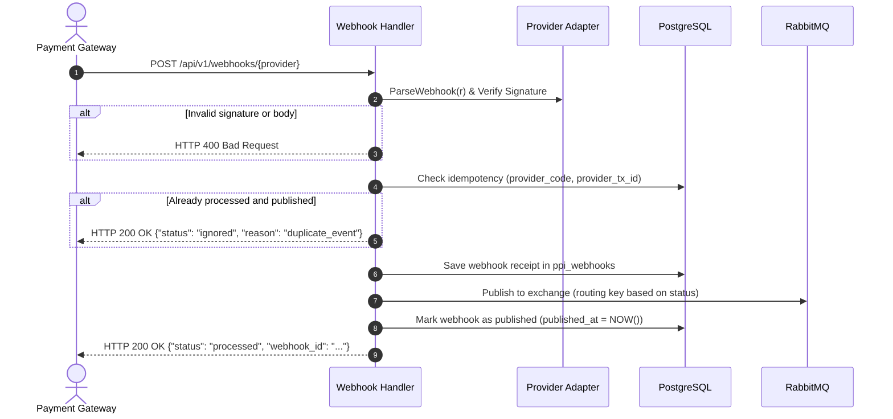

# Webhooks API

The Webhooks API receives, verifies, deduplicates, and forwards asynchronous payment notifications sent by external payment gateways (e.g. Chapa, Stripe, or the development Fake Provider).

---

## 1. Webhook Ingestion Pipeline



---

## 2. Ingest Webhook

`POST /api/v1/webhooks/{provider}`

Ingests an asynchronous event delivered by a payment gateway.

### Path Parameters
- `provider` (string, required): Registered provider code (e.g. `"fake"`, `"chapa"`, `"stripe"`).

### Request Payload (Example for Provider `"fake"`)
```json
{
  "event_id": "evt_9f3a1e28",
  "event": "charge.success",
  "tx_ref": "tx_inv1_1727865600",
  "reference": "fake_ref_6b1e5a28-3e4e-4f7d-8f2c-e5d0a68c92a1",
  "status": "success",
  "amount_minor": 1000,
  "currency": "ETB",
  "timestamp": 1727865650
}
```

### Provider Responses
- **First Delivery (`200 OK`)**:
  ```json
  {
    "status": "processed",
    "webhook_id": "evt_9f3a1e28"
  }
  ```
- **Duplicate Ignored Delivery (`200 OK`)**:
  ```json
  {
    "status": "ignored",
    "reason": "duplicate_event"
  }
  ```
- **Parse / Signature Verification Failure (`400 Bad Request`)**:
  ```json
  {
    "code": "INVALID_SIGNATURE",
    "message": "Invalid webhook payload or signature: ..."
  }
  ```
- **Unsupported Provider (`404 Not Found`)**:
  ```json
  {
    "code": "UNSUPPORTED_PROVIDER",
    "message": "Unsupported payment provider: unknown_provider"
  }
  ```

---

## 3. RabbitMQ Message Broker Topology

When a webhook is received and verified, it is published to the RabbitMQ broker with routing keys determined by the payment outcome:

| Outcome Status | Routing Key | Downstream Consumer Action |
| :--- | :--- | :--- |
| `SUCCEEDED` | `ppi.webhook.payment.succeeded` | State machine fires `pay` on invoice; updates balances; transitions invoice to `PAID`. |
| `FAILED` | `ppi.webhook.payment.failed` | Records failed attempt in `payment_attempts`; triggers dunning alert. |
| `PENDING` | `ppi.webhook.payment.pending` | Updates `payment_attempts` with provider transaction references. |

### Message Payload Contract Dispatched to RabbitMQ
```json
{
  "webhook_id": "evt_9f3a1e28",
  "provider_code": "fake",
  "event_type": "charge.success",
  "internal_tx_id": "tx_inv1_1727865600",
  "provider_tx_id": "fake_ref_6b1e5a28-3e4e-4f7d-8f2c-e5d0a68c92a1",
  "status": "SUCCEEDED",
  "amount": {
    "amount_minor": 1000,
    "currency": "ETB"
  },
  "raw_payload": { ... },
  "occurred_at": "2026-10-02T10:00:50Z"
}
```
