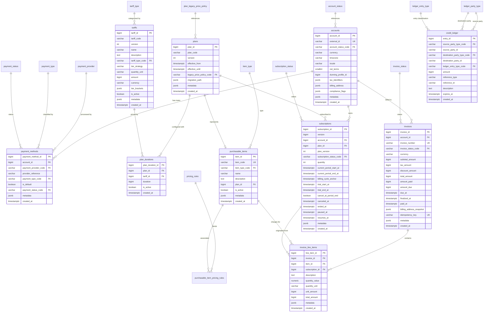
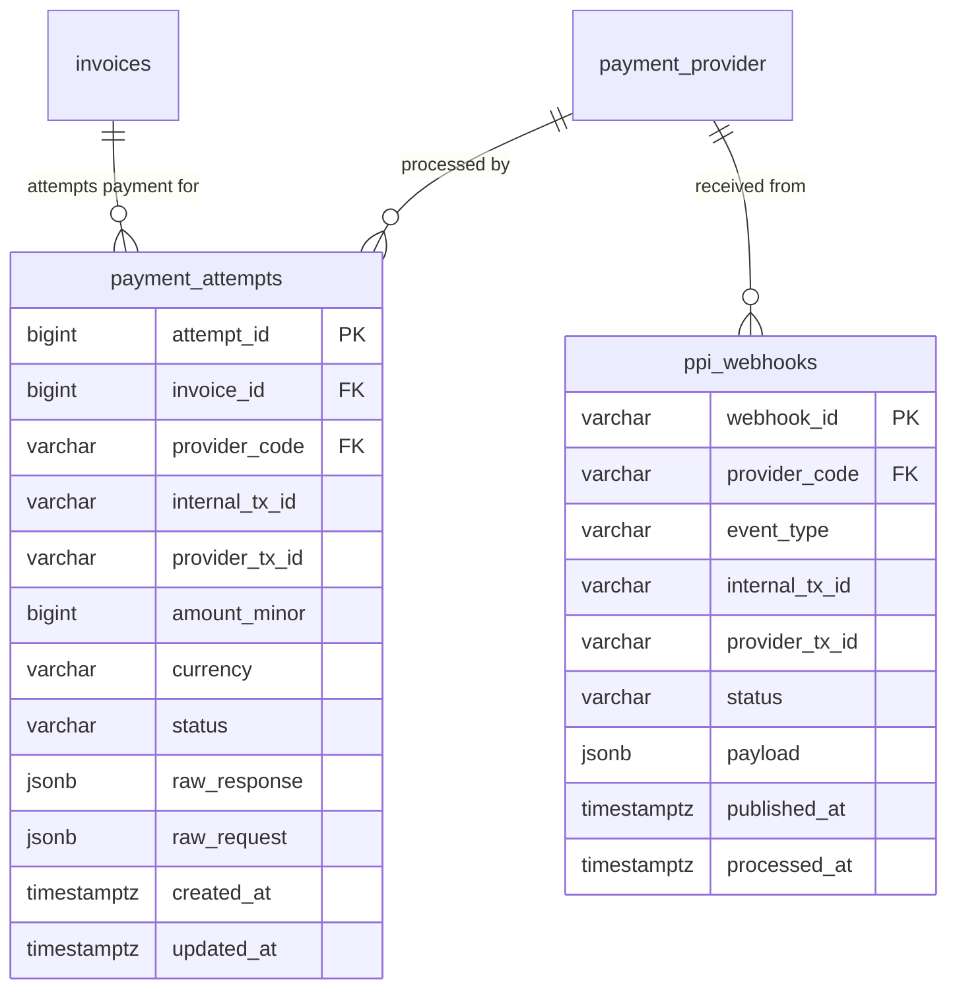
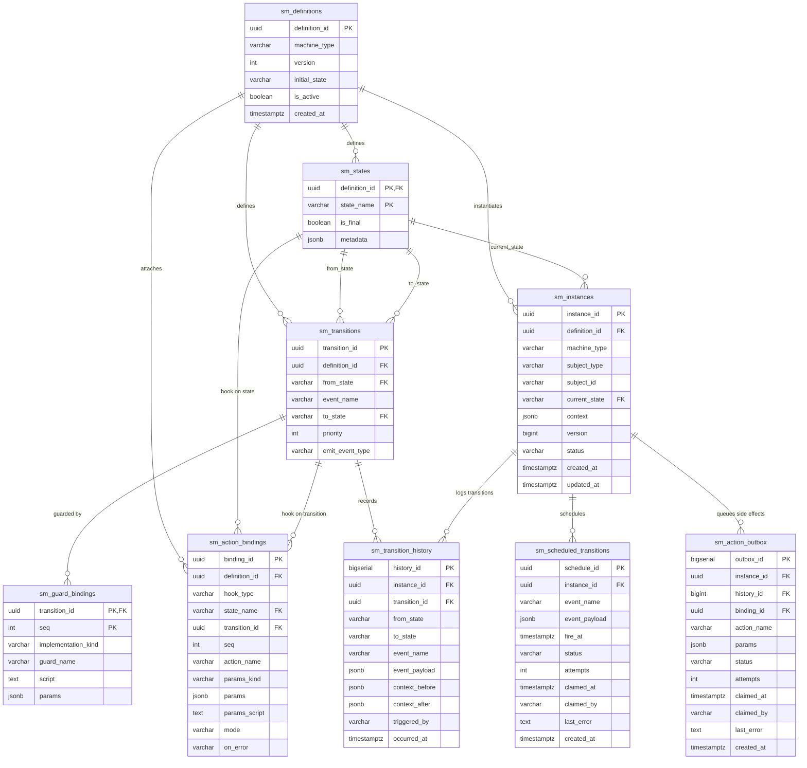
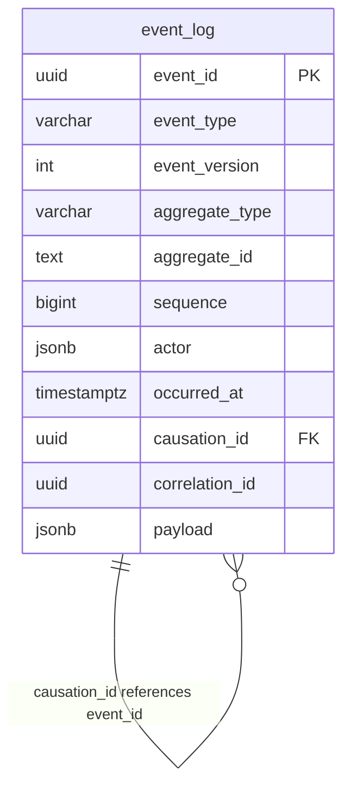

# Database Entity-Relationship Diagrams (ERD)

This section maps out the physical data models and relational structures across the system.

---

## 1. Core Billing Domain

The primary operational model covers customer accounts, payment methods, the pricing catalog (tariffs, plans, purchasable items), subscriptions, invoices, and the credit ledger.

---

## 2. Payments & Webhooks Processing

The payment interface layer isolates external gateway interactions, partial payment attempts, and webhook audit trails.

---

## 3. Dynamic State Machine Engine

The generic state machine framework manages lifecycle execution for domains such as `invoice_lifecycle` and `subscription_lifecycle`.

---

## 4. Append-Only Event Store

The event ledger records historical state mutations.

