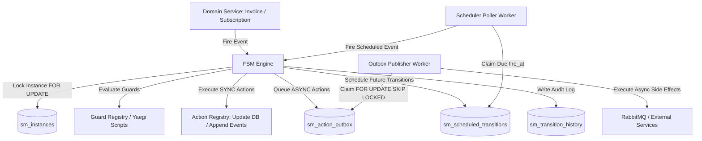

# Dynamic State Machine Engine

The Gebeta Billing service embeds a database-driven, transactional Finite State Machine (FSM) engine located in `internal/shared/statemachine`. It orchestrates stateful business lifecycles with durability, guard evaluations, action execution hooks, outbox-based async messaging, and scheduled timers.

---

## 1. State Machine Engine Architecture



---

## 2. Engine Tables & Responsibilities

| Table Name | Storage Purpose | Key Columns |
| :--- | :--- | :--- |
| `sm_definitions` | Machine blueprint version header | `definition_id`, `machine_type`, `version`, `initial_state`, `is_active` |
| `sm_states` | Valid states per definition | `(definition_id, state_name)`, `is_final`, `metadata` |
| `sm_transitions` | Directed transition graph | `transition_id`, `from_state`, `event_name`, `to_state`, `priority`, `emit_event_type` |
| `sm_guard_bindings` | Transition entry predicates | `transition_id`, `seq`, `implementation_kind` (`GO_REGISTRY` \| `SCRIPT`), `guard_name`, `script` |
| `sm_action_bindings` | Hooked side effects | `binding_id`, `hook_type` (`ON_ENTER` \| `ON_EXIT` \| `ON_TRANSITION`), `action_name`, `mode` (`SYNC` \| `ASYNC`), `on_error` (`ABORT` \| `CONTINUE`) |
| `sm_instances` | Live subject execution state | `instance_id`, `machine_type`, `subject_type`, `subject_id`, `current_state`, `context`, `version`, `status` |
| `sm_transition_history`| Chronological audit journal | `history_id`, `instance_id`, `transition_id`, `from_state`, `to_state`, `context_before`, `context_after` |
| `sm_scheduled_transitions`| Timed events queue | `schedule_id`, `instance_id`, `event_name`, `fire_at`, `status` |
| `sm_action_outbox` | Asynchronous action queue | `outbox_id`, `instance_id`, `action_name`, `params`, `status` |

---

## 3. Registered Machine Blueprints

### 1. Invoice Lifecycle (`invoice_lifecycle`)

- **Initial State**: `DRAFT`
- **States**: `DRAFT`, `OPEN`, `PAID` (final), `UNCOLLECTIBLE` (final), `VOID` (final)
- **Transitions**:
  ```mermaid
  stateDiagram-v2
      [*] --> DRAFT
      DRAFT --> OPEN : finalize [Action: invoice.action.finalize]
      OPEN --> PAID : pay [Action: invoice.action.mark_paid]
      OPEN --> VOID : void [Action: invoice.action.void]
      OPEN --> UNCOLLECTIBLE : uncollectible
  ```

- **Registered Actions**:
  - `invoice.action.finalize`: Generates sequential `invoice_number`, calculates totals, sets `due_at` and `finalized_at`, and returns the open invoice projection.
  - `invoice.action.mark_paid`: Sets status to `PAID`, updates `amount_paid`, clears `amount_due`, and sets `paid_at`.
  - `invoice.action.void`: Sets status to `VOID`, preserving historical balances for audit integrity.

### 2. Subscription Lifecycle (`subscription_lifecycle`)

- **Initial State**: `ACTIVE`
- **States**: `ACTIVE`, `PAUSED`, `CANCELED` (final)
- **Transitions**:
  ```mermaid
  stateDiagram-v2
      [*] --> ACTIVE
      ACTIVE --> PAUSED : pause [Action: subscription.transition]
      PAUSED --> ACTIVE : resume [Action: subscription.transition]
      ACTIVE --> CANCELED : cancel [Action: subscription.transition]
      PAUSED --> CANCELED : cancel [Action: subscription.transition]
  ```

- **Registered Actions**:
  - `subscription.transition`: Updates `subscription_status_code` in the `subscriptions` table inside the transaction and records transition metadata in the working context.

---

## 4. Hook Execution Modes & Error Policies

### Execution Modes
1. **`SYNC`**:
   - The action executes **inside the same database transaction** as the state machine transition.
   - If the action fails and its policy is `ABORT`, the entire transition is rolled back.
   - Used for core ledger mutations, inventory reservation, and balance calculations.

2. **`ASYNC`**:
   - An outbox record is inserted into `sm_action_outbox` inside the transition transaction.
   - The transition commits immediately.
   - The background worker (`outbox.Publisher`) claims pending rows and executes the action out-of-band.

### Error Policies
- **`ABORT`**: Failure aborts and rolls back the transition.
- **`CONTINUE`**: Failure logs an error, records the fault in `sm_action_outbox.last_error`, and allows the transition to complete.
